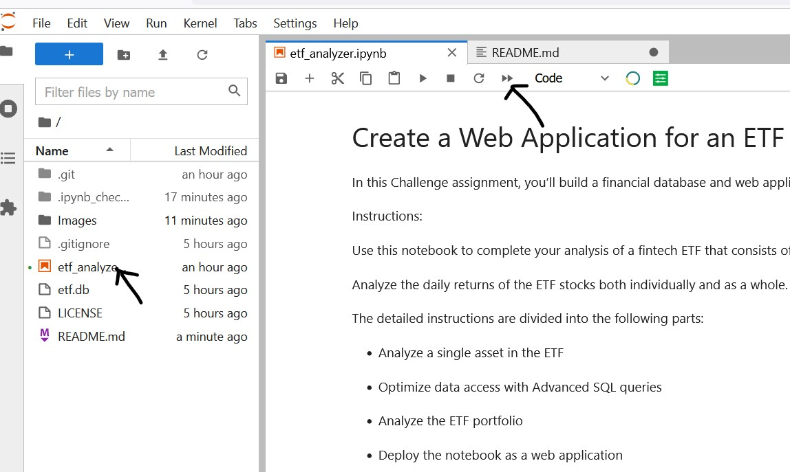
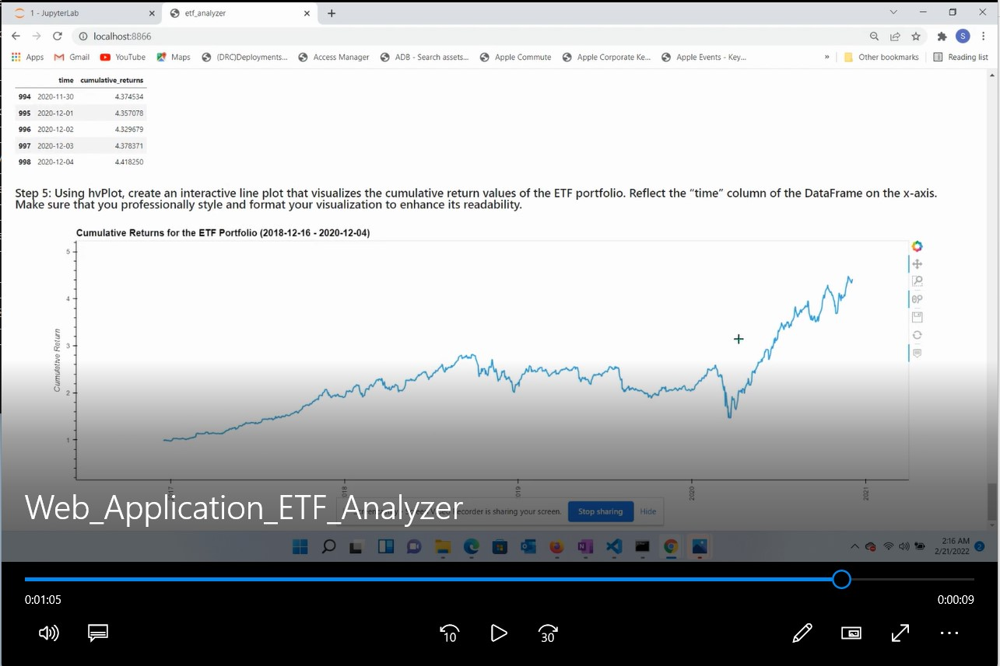

# etf_analyzer
This is a python-jupyter notebook integrated development environment(IDE) based ETF Analyser to analyze the performance of a hypothetical fintech ETF. The notebook works as per the standard phases of finacial analysis by extracting data from database tables, preparation of datasets by cleaning the data and finally analyzing the data through quantitative analysis and visualizations. We use SQL, Python and the Voilà library for the various steps involved from data gathering and preparation to visualization over Jupyter Notebook as well as browserbased App rendered with the Voilà library. 


## Technologies

This project leverages python 3.7 with the following packages:

* [Jupyter Lab](https://jupyterlab.readthedocs.io/en/stable/#) - Is a browser-based interface to work with documents and activities such as Jupyter notebooks, text editors, terminals, and custom components in a flexible, integrated, and extensible manner.

* [Voilà](https://voila.readthedocs.io/en/stable/index.html) - Voilà allows you to convert a Jupyter Notebook into an interactive dashboard that allows you to share your work with others. It is secure and customizable, giving you control over what your readers experience.

Note:
* [hvplot](https://hvplot.holoviz.org/user_guide/Introduction.html) - hvplot makes interactive visualization available through Jypyter Notebook and Voilà. 

---

## Installation Guide

You will need Python version 3.7 or above and gitbash/terminal on your computer, along with other supporting packages as mentioned below. 

Please follow instructions from the below link to install python 3.7 or above on your computer

[To install Python, follow instructions from this link](https://www.python.org/downloads/)

[To install Git Bash, follow instructions from this link](https://github.com/git-guides/install-git)

[To install Voilà, follow instructions from this link](https://voila.readthedocs.io/en/stable/install.html)


To access the Jupiter notebook, first install the following dependencies.

 [Anaconda](https://docs.anaconda.com/anaconda/install/)

```python
# install conda dev environment and activate it
  conda update conda
  conda create -n dev python=3.7 anaconda
  conda activate dev
#  install Jupyter Lab
   pip install jupyterlab

# install Voilà to use voila library to display jupyter notebook as browser based app
   pip install voila
    
```


---


## Usage

To use the Jupyter Notebook, clone the repository and do not forget to run the above commands as applicable,

```git
git clone https://github.com/sidbetatester/etf_analyzer
```

Upon launching the Jypyter notebook, you will notice an interface similar to the one below, click  on the 'etf_analyzer.ipynb' file and you will have the complete analysis. 


```python
# to view the jypyter notebook as a browser based app using voila, run the following in gitbash terminal
voila etf_analyzer.ipynb

```

[](Images/Web_Application_ETF_Analyzer.mp4)


Note:
* You can shut down the notebook from the File menu when you are done using the report.
* You can shut down the voila app by pressing 'ctrl' and  'c' together while in the  terminal


## Contributors

Siddharth Venkumahanti
[linkedin](https://www.linkedin.com/in/siddharthvenkumahanti/)


---


## License

### MIT License

Copyright (c) [2022] [Siddharth Venkumahanti]

Permission is hereby granted, free of charge, to any person obtaining a copy
of this software and associated documentation files (the "Software"), to deal
in the Software without restriction, including without limitation the rights
to use, copy, modify, merge, publish, distribute, sublicense, and/or sell
copies of the Software, and to permit persons to whom the Software is
furnished to do so, subject to the following conditions:

The above copyright notice and this permission notice shall be included in all
copies or substantial portions of the Software.

THE SOFTWARE IS PROVIDED "AS IS", WITHOUT WARRANTY OF ANY KIND, EXPRESS OR
IMPLIED, INCLUDING BUT NOT LIMITED TO THE WARRANTIES OF MERCHANTABILITY,
FITNESS FOR A PARTICULAR PURPOSE AND NONINFRINGEMENT. IN NO EVENT SHALL THE
AUTHORS OR COPYRIGHT HOLDERS BE LIABLE FOR ANY CLAIM, DAMAGES OR OTHER
LIABILITY, WHETHER IN AN ACTION OF CONTRACT, TORT OR OTHERWISE, ARISING FROM,
OUT OF OR IN CONNECTION WITH THE SOFTWARE OR THE USE OR OTHER DEALINGS IN THE
SOFTWARE.


